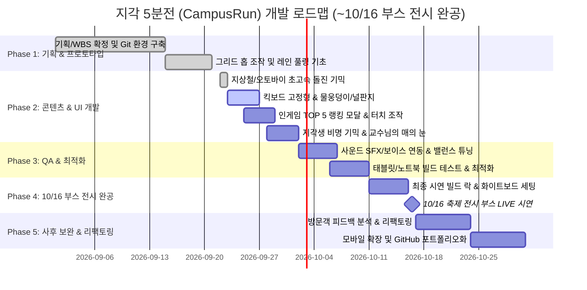

# WBS (Work Breakdown Structure) — 지각 5분전 (CampusRun)

> **프로젝트명:** 지각 5분전 - 1교시를 향해 달려라! (CampusRun)  
> **문서 버전:** 3.1.0 (거리별 3대 구역 및 6대 기믹 체계 반영)  
> **최종 개정일:** 2026-09-22  
> **기준 문서:** [지각 5분전!! 초안 ver2.html](file:///C:/UnityProjects/CampusRun_Git/.planning/resources/%EC%A7%80%EA%B0%81%205%EB%B6%84%EC%A0%84%21%21%20%EC%B4%88%EC%95%88%20ver2.html)

---

## 1. 4인 팀 역할 분담 및 책임 매트릭스 (R&R)

| 성명 | 역할 / 직무 | 핵심 책임 영역 및 세부 개발 범위 |
|:---|:---|:---|
| **강민권** | **메인 개발자 (Core)** | • 1x1 그리드 홉(Hop) 이동 조작 메커니즘 및 New Input System 연동 • 절차적 무한 등교길 레인(보도블록/도로/철도/물웅덩이) 스폰 엔진 • 충돌 판정, 실시간 이동 거리(Score) 계산 및 로컬 랭킹 연동 • GitHub 저장소 통합, 브랜치 관리 및 프로젝트 빌드 총괄 |
| **김윤상** | **보조 개발자 (Sub)** | • 장애물(지상철, 타과 지각생, 널판지 등) 이동 및 기믹 로직 구현 • '교수님의 매의 눈' 3~5초 타임아웃 즉사 판정 로직 • 게임 상태(Title/Playing/GameOver) 관리 및 인게임 UI 스크립팅 • 캠퍼스 공감 사운드(BGM/SFX/비명 보이스) 매니저 및 태블릿 빌드 QA |
| **박성엽** | **게임 기획 / UI** | • 단일 등교길 3대 구역 난이도 곡선 및 스폰 빈도/속도 밸런싱 • 시작 전 / 종료 후 TOP 5 랭킹 팝업 UI 레이아웃 설계 • 학점 등급(A+ ~ F) 기준 수립 및 결과 성적표 디자인 • Figma 기반 UI 와이어프레임 및 uGUI 반응형 앵커링 |
| **김진석** | **3D 아티스트** | • 대학생/교수님/타과 지각생 3D 로우폴리 캐릭터 모델링 & 리깅 • 킥보드, 셔틀버스, 지상철, 물웅덩이/널판지 3D 프리팹 제작 • 충돌 피격 먼지, 바닥 붉은색 경고선, A+ 축하 폭죽 파티클 VFX • Animator 컨트롤러 연결 및 홉 바운스 점프 모션 연출 |

---

## 2. 세부 WBS 태스크 분해 (Leaf Task)

### 1. 플레이어 & 조작 영역 (강민권)
- **1.1 그리드 홉(Hop) 이동 시스템**
  - [x] 1.1.1 1x1 단위 상/하/좌/우 입력 처리 (키보드 방향키 + WASD) (1d)
  - [x] 1.1.2 홉(포물선 점프) 애니메이션 및 부드러운 이동 트위닝 (1d)
  - [ ] 1.1.3 태블릿 화면 탭(전진) 및 온스크린 터치 버튼 연동 (1.5d)
  - [ ] 1.1.4 물웅덩이 위 널판지 탑승 시 좌우 강제 이동(Drift) 물리 연동 (1.5d)
- **1.2 플레이어 충돌 및 판정**
  - [x] 1.2.1 이동 장애물(셔틀버스, 지상철/오토바이) 충돌 판정 (1d)
  - [x] 1.2.2 쿼터뷰 추격 카메라 및 후방 낙오 판정 (1d)
  - [ ] 1.2.3 물웅덩이 추락(화면 밖 떠내려감) 익사 판정 (1d)

### 2. 레인(Lane) 스폰 엔진 & 장애물 기믹 (강민권 / 김윤상)
- **2.1 절차적 등교길 레인 풀링 (강민권)**
  - [x] 2.1.1 안전 보도블록 레인 및 도로 레인 베이스 구축 (1.5d)
  - [x] 2.1.2 `UnityEngine.Pool.ObjectPool<T>` 기반 레인 재활용 (1.5d)
  - [x] 2.1.3 플레이어 전진에 따른 동적 생성 및 후방 레인 회수 (1d)
  - [ ] 2.1.4 거대 물웅덩이 레인 베이스 및 널판지 스폰 연동 (1.5d)
- **2.2 장애물 기믹 컨트롤러 (김윤상)**
  - [x] 2.2.1 도로 레인 횡단 셔틀버스 스포너 및 차량 풀링 (1.5d)
  - [x] 2.2.2 캠퍼스 관통 지상철/오토바이 초고속 돌진 레인 (바닥 붉은 경고선 1초 점멸 + 30m/s 질주) (2d)
  - [ ] 2.2.3 보도블록 고정형 길막 장애물 (방치된 공유 킥보드, 동기 무리) 스폰 (1d)
  - [ ] 2.2.4 거대 물웅덩이 위를 떠다니는 널판지/박스 이동 로직 (1.5d)
  - [ ] 2.2.5 "아악 늦었다!" 비명 소리와 함께 질주하는 타과 지각생 기믹 (1.5d)
  - [ ] 2.2.6 3~5초 정체 시 강제 F학점을 부여하는 '교수님의 매의 눈' 타임아웃 기믹 (1.5d)

### 3. 3D 그래픽 에셋 & VFX (김진석)
- **3.1 3D 로우폴리 모델링 & 프리팹**
  - [ ] 3.1.1 대학생 주인공 및 타과 지각생, 교수님 3D 모델링 (2.5d)
  - [ ] 3.1.2 고정 장애물: 방치된 공유 킥보드, 잡담 무리 프리팹 (1.5d)
  - [x] 3.1.3 이동 장애물: 셔틀버스, 오토바이/지상철 프리팹 (2d)
  - [ ] 3.1.4 지형 프롭: 거대 물웅덩이 및 떠다니는 널판지/박스 프리팹 (1.5d)
- **3.2 비주얼 이펙트 (VFX)**
  - [x] 3.2.1 지상철/오토바이 진입 전 바닥 붉은색 경고선 표시기 (1d)
  - [ ] 3.2.2 물웅덩이 첨벙 물튀김 파티클 및 충돌 피격 먼지 VFX (1d)
  - [ ] 3.2.3 500m(A+) 돌파 시 황금빛 축하 폭죽 파티클 (1d)

### 4. UI 및 랭킹 시스템 (박성엽 / 김윤상 / 강민권)
- **4.1 인게임 HUD 및 결과 모달 (김윤상 / 박성엽)**
  - [x] 4.1.1 실시간 이동 거리(Score) 카운터 상단 HUD (1d)
  - [x] 4.1.2 게임오버 성적표 팝업 (탈락 사유, 최종 거리, 학점 뱃지, 재도전) (1.5d)
  - [ ] 4.1.3 게임 시작 전(타이틀) 및 종료 후 열람 가능한 **'🏆 TOP 5 랭킹 보기'** 모달 UI (1.5d)
- **4.2 랭킹 데이터 & 밸런싱 (강민권 / 박성엽)**
  - [ ] 4.2.1 `PlayerPrefs` 기반 로컬 TOP 5 기록 저장 및 정렬/조회 시스템 (1.5d)
  - [ ] 4.2.2 3대 구역(정문 앞 삼거리 ➔ 마의 헐떡고개) 스폰 빈도 및 속도 곡선 튜닝 (1.5d)
  - [x] 4.2.3 학점 등급 판정 기준 적용 (500m+ A+, 200~499m B~C, 200m- F) (0.5d)

### 5. 사운드, 부스 운영 및 QA (김윤상 / 팀 전체)
- **5.1 오디오 시스템 구축 (김윤상)**
  - [ ] 5.1.1 BGM 루프 및 인게임 사운드 매니저 (`AudioManager.cs`) (1.5d)
  - [ ] 5.1.2 공감 SFX 탑재 (점프음, 버스 경적, 건널목 종소리, 지각생 "아악 늦었다!" 비명, 교수님 기침) (2d)
- **5.2 부스 운영 준비 및 최종 QA (팀 전체)**
  - [ ] 5.2.1 태블릿 PC / 노트북 타겟 빌드 성능 프로파일링 및 60fps 고정 (2d)
  - [ ] 5.2.2 부스 입구 화이트보드 랭킹판 양식 제작 및 수기 운영 매뉴얼 확정 (1d)
  - [ ] 5.2.3 10/16 현장 배포용 무편집 시연 영상 사전 촬영 (1d)

---

## 3. 개발 로드맵 및 5대 Phase 일정

---

## 4. 공수 집계 요약

| 영역 | 순수 개발 공수 | 상태 | 비고 |
|:---|:---:|:---:|:---|
| **1. 플레이어 & 조작계** | 5.5d | 진행중 | 홉 조작(완료), 널판지 탑승 드리프트 & 터치 지원 |
| **2. 레인 스폰 & 6대 기믹** | 8.5d | 진행중 | 레인 풀링 & 지상철/오토바이(완료), 킥보드/물웅덩이/지각생/교수님 |
| **3. 3D 에셋 & VFX** | 9.0d | 예정 | 지상철 경고선(완료), 로우폴리 3D 모델 및 물튀김 파티클 |
| **4. UI & 랭킹 시스템** | 5.5d | 진행중 | HUD/결과창(완료), TOP 5 랭킹 모달 및 PlayerPrefs |
| **5. 사운드 & 부스 QA** | 7.5d | 예정 | 비명 보이스/건널목 종소리/BGM + 태블릿 최적화 + 시연 가이드 |
| **소계** | **36.0d** | - | 4인 분배 시 1인당 약 9일 (매우 현실적 일정) |
| **안전 버퍼 (20%)** | **+ 7.0d** | - | 축제 5일 전(10/11) 최종 빌드 락 확보 |
| **총 공수** | **43.0d** | - | 10/16 부스 전시 마일스톤 100% 대응 가능 |
