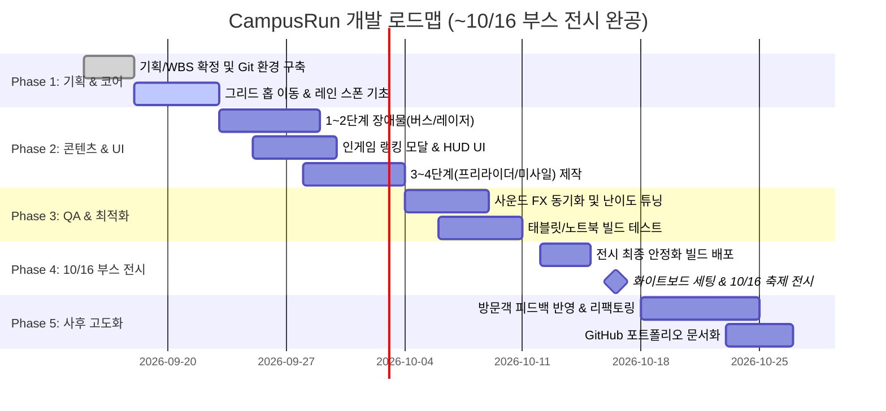

# WBS (Work Breakdown Structure) — CampusRun

> **문서 버전:** 2.0.0 (길건너 친구들 스타일 & 10/16 전시 마일스톤 반영)  
> **작성일:** 2026-09-15  
> **작성자:** CampusRun 개발팀 (4인)  
> **기준 가이드:** [캠퍼스 런 초기 계획 및 스토리보드.html](file:///C:/Users/USER/Downloads/%EC%B4%88%EA%B8%B0%20%EA%B3%84%ED%9A%8D%20%EB%B0%8F%20%EC%8A%A4%ED%86%A0%EB%A6%AC%EB%B3%B4%EB%93%9C%20(1)/%EC%B4%88%EA%B8%B0%20%EA%B3%84%ED%9A%8D%20%EB%B0%8F%20%EC%8A%A4%ED%86%A0%EB%A6%AC%EB%B3%B4%EB%93%9C/%EC%BA%A0%ED%8D%BC%EC%8A%A4%20%EB%9F%B0%20%EC%B4%88%EA%B8%B0%20%EA%B3%84%ED%9A%8D%20%EB%B0%8F%20%EC%8A%A4%ED%86%A0%EB%A6%AC%EB%B3%B4%EB%93%9C.html)

---

## 1. 4인 팀 역할 분담 및 책임 매트릭스

| 역할 | 담당자 명칭 | 핵심 책임 영역 |
|:---|:---|:---|
| **팀장 / 메인 개발자** | Core Programmer | • 그리드 기반 홉(Hop) 이동 및 New Input System 조작계 • 레인(Lane) 기반 무한/절차적 맵 스폰 엔진 • 장애물 충돌 판정 및 점수/랭킹 데이터 로직 • GitHub 저장소 및 프로젝트 통합 총괄 |
| **게임 디자이너 / UI** | Game & UI Designer | • 4개 스테이지 장애물 기믹 & 난이도 곡선 밸런싱 • 인게임 시작 전 / 종료 후 TOP 랭킹 팝업 UI 제작 • Figma 기반 UI 와이어프레임 및 uGUI 앵커링 레이아웃 • 학점 등급(A+ ~ F) 판정 기준 수립 |
| **3D 아티스트 / 애니메이터** | 3D Asset & FX | • 대학생/교수님 3D 로우폴리 캐릭터 모델링 & 리깅 • 셔틀버스, 과제 폭탄, 출석 레이저, 프리라이더 3D 프리팹 • 피격, 점프, 클리어 황금 폭죽 파티클(VFX) • Animator 컨트롤러 연결 및 홉 바운스 모션 연출 |
| **사운드 & 부스 매니저** | Sound & QA Operational | • 스테이지별 BGM 및 공감 SFX (알람, 분필, 카톡, 환호성) • 태블릿 PC 및 노트북 타겟 빌드 성능 테스트 • 부스 현장 화이트보드 랭킹판 세팅 및 수기 운영 가이드 • 축제 당일 대기열 관리 및 1분 회전율 최적화 |

---

## 2. 세부 WBS 태스크 분해 (1~3일 단위 Leaf Task)

### 1. 플레이어 & 조작 영역 (메인 개발자)
- **1.1 그리드 홉(Hop) 이동 시스템**
  - 1.1.1 1칸 단위 상/하/좌/우 입력 처리 (키보드 방향키 + WASD) (1.5d)
  - 1.1.2 홉(포물선 점프) 애니메이션 및 부드러운 이동 트위닝 (1.5d)
  - 1.1.3 태블릿 화면 탭 / 온스크린 터치 패드 입력 연동 (1.5d)
- **1.2 플레이어 충돌 및 생존 로직**
  - 1.2.1 이동 장애물(차량, 미사일) 충돌 시 즉시 납작해짐/날아감 판정 (1d)
  - 1.2.2 후방 추격 카메라 및 지체 시 타임아웃 탈락 판정 (1.5d)

### 2. 레인(Lane) 기반 월드 스폰 엔진 (메인 개발자)
- **2.1 절차적 레인 생성 및 풀링**
  - 2.1.1 안전 레인(보도블록/잔디) 및 위험 레인(도로/강의실/복도) 베이스 (2d)
  - 2.1.2 `UnityEngine.Pool.ObjectPool<Lane>` 기반 레인 재활용 (2d)
- **2.2 레인별 장애물 이동 컨트롤러**
  - 2.2.1 좌/우 지정 속도로 달리는 셔틀버스/차량 스포너 (1.5d)
  - 2.2.2 주기적으로 점멸하는 출석체크 레이저 기믹 (1.5d)
  - 2.2.3 상공에서 낙하하는 과제 폭탄 스포너 (1.5d)

### 3. 3D 그래픽 및 에셋/VFX (3D 아티스트)
- **3.1 3D 로우폴리 모델링 & 프리팹화**
  - 3.1.1 대학생 주인공 캐릭터 및 홉 점프 애니메이션 (2.5d)
  - 3.1.2 1단계: 셔틀버스, 전단지 배포자, 인도 웅덩이 프리팹 (2d)
  - 3.1.3 2단계: 교수님 캐릭터, 출석 레이저 기둥, 과제 상자 (2d)
  - 3.1.4 3~4단계: 프리라이더, 유도 F학점 미사일, 학점 서버 (2.5d)
- **3.2 파티클 및 비주얼 이펙트 (VFX)**
  - 3.2.1 피격 충돌 먼지/스파크 VFX (1d)
  - 3.2.2 4단계 클리어 A+ 황금빛 폭죽 폭발 VFX (1.5d)

### 4. UI & 랭킹 시스템 (게임 디자이너 / UI)
- **4.1 인게임 HUD 및 결과 모달**
  - 4.1.1 실시간 전진 거리(m) 카운터 및 상단 HUD (1.5d)
  - 4.1.2 게임오버 결과창 (탈락 사유, 최종 거리, 학점 A+~F 뱃지) (1.5d)
  - 4.1.3 타이틀 화면 및 시작 전 '🏆 TOP 랭킹 보기' 팝업 모달 (2d)
- **4.2 난이도 밸런싱 & 데이터 로직**
  - 4.2.1 스테이지별 이동 속도 및 장애물 간격 곡선 튜닝 (1.5d)
  - 4.2.2 `PlayerPrefs` 기반 로컬 명예의 전당 (1~5위) 저장/조회 로직 (1.5d)

### 5. 사운드, 부스 운영 및 QA (사운드 & 부스 매니저)
- **5.1 오디오 시스템 구축**
  - 5.1.1 스테이지별 BGM 루프 사운드 편집 및 크로스페이드 (1.5d)
  - 5.1.2 공감 SFX 탑재 (알람 초침, 셔틀 경적, 분필, 카톡, 종강 환호) (2d)
- **5.2 부스 운영 및 시연 검증**
  - 5.2.1 태블릿 PC / 노트북 타겟 해상도 고정 및 성능 프로파일링 (2d)
  - 5.2.2 부스용 화이트보드 랭킹판 양식 제작 및 1분 회전율 운영 매뉴얼 (1d)
  - 5.2.3 10/16 현장 비상용 무편집 시연 영상 사전 촬영 (1d)

---

## 3. 로드맵 및 일정 매핑 (~ 10/16 전시 완성 & 사후 고도화)

---

## 4. 공수 집계 요약

| 영역 | 순수 개발일 | 비고 |
|:---|:---:|:---|
| **1. 플레이어 & 조작계** | 7.0d | 키보드 + 태블릿 터치 홉 |
| **2. 레인 스폰 & 장애물 엔진** | 8.5d | 레인 풀링 및 이동 로직 |
| **3. 3D 에셋 & VFX** | 10.0d | 4개 스테이지 로우폴리 + 파티클 |
| **4. UI & 랭킹 시스템** | 6.5d | 인게임 랭킹 모달 + 밸런싱 |
| **5. 사운드 & 부스 운영 QA** | 7.5d | BGM/SFX + 태블릿 최적화 + 시연 |
| **소계** | **39.5d** | 4인 분배 시 1인당 약 10일 |
| **안전 버퍼 (20%)** | **+ 8.0d** | 축제 3일 전 빌드 락(Lock) 확보 |
| **총 공수** | **47.5d** | 10/16 마일스톤 완벽 대응 |
